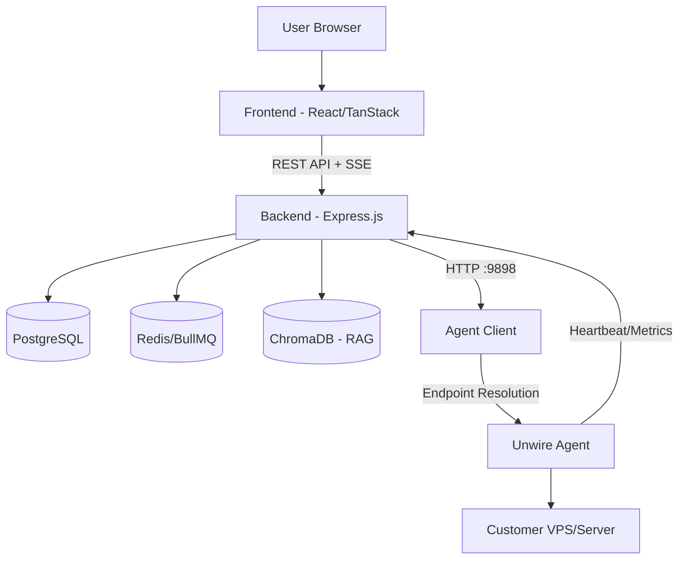
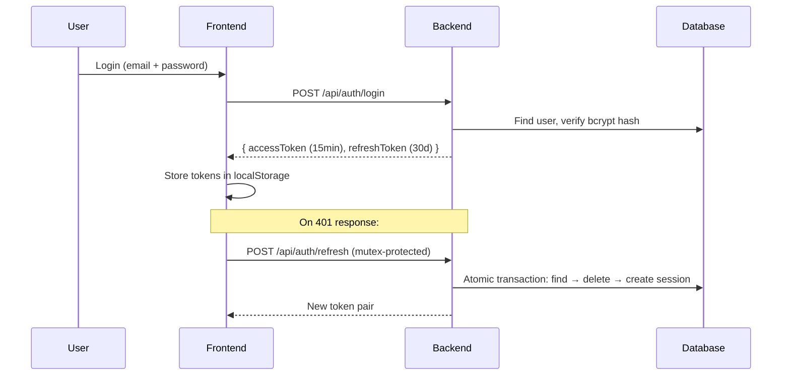
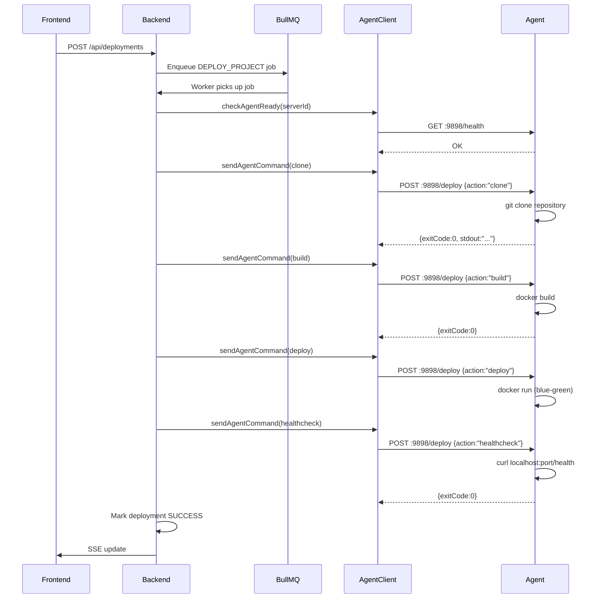

# System Architecture

## High-Level Overview



## Request Flow

```
Browser → Frontend (TanStack Router)
    → apiFetch() [src/services/api.ts]
    → Authorization header + X-Organization-Id header
    → Express middleware chain:
        → requestId → requestLogger → globalLimiter → optionalAuth
        → route-specific: authenticate → withOrgContext → validate → requireOwnership
    → Controller (validates, delegates)
    → Service (business logic)
    → Prisma (database) / AgentClient (server) / External APIs
    → Response { success: true/false, data/error }
    → Frontend state update
```

## Authentication Flow



## Server Connection Flow

```mermaid
sequenceDiagram
    participant U as User
    participant F as Frontend
    participant B as Backend
    participant A as Agent
    participant S as Server

    U->>F: Add Server (name, host)
    F->>B: POST /api/servers (generates agentToken)
    B-->>F: { serverId, agentToken }
    F->>U: Show install command
    
    U->>S: Paste install command
    S->>S: Install agent binary + systemd service
    A->>B: POST /api/agent-push/register (token)
    B-->>A: { serverId }
    
    loop Every 15 seconds
        A->>B: POST /api/servers/:id/heartbeat
        A->>B: POST /api/servers/:id/metrics
        A->>B: POST /api/agent-push/:id/processes
    end
    
    B->>F: SSE event (metric/heartbeat/status)
    F->>F: Update UI in real-time
```



## Deployment Flow



## Command Execution Flow

```
Frontend: User clicks "Run" on a command
    → POST /api/commands/servers/:id/execute { commandId, params }
    → commandService.executeCommand()
    → Lookup command in commandRegistry.ts (whitelist only)
    → resolveCommandString() with parameters
    → sendAgentCommand(serverId, {action:"exec", repository: command})
    → Agent: exec(command) with timeout
    → Result: {exitCode, stdout, stderr, durationMs}
    → Store in usageRecord
    → Broadcast via SSE
    → Frontend polls for result
```

## Agent Endpoint Resolution

The backend's `agentClient.ts` resolves where to reach the agent:

```
1. If server.host is "host.docker.internal" → try 127.0.0.1
2. If server.host is a real IP → try it directly
3. Always try 127.0.0.1 as fallback (for local dev with exposed ports)
4. Try last heartbeat IP (address agent connected FROM)
5. Each candidate gets a 1.5s health probe (GET :9898/health)
6. First responding address is used
```

## Database Schema (Key Models)

- **User** — auth, profile, org memberships
- **Organization** — multi-tenancy boundary
- **OrganizationMember** — role-based access
- **Server** — connected servers with agentToken
- **ServerMetric** — time-series CPU/RAM/Disk/Network
- **ServerHeartbeat** — agent liveness tracking
- **ServerApp** — detected processes/containers
- **ServerLog** — collected log entries
- **Deployment** — deployment runs with steps and logs
- **Project** — analyzed codebases
- **InfraConnection** — cloud provider credentials (encrypted)
- **CloudResource** — discovered cloud resources
- **Alert/Incident** — monitoring alerts
- **Subscription** — billing plan management
- **UsageRecord** — tracks AI usage, command history, software installs
